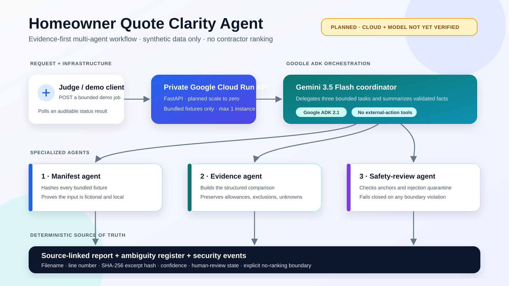
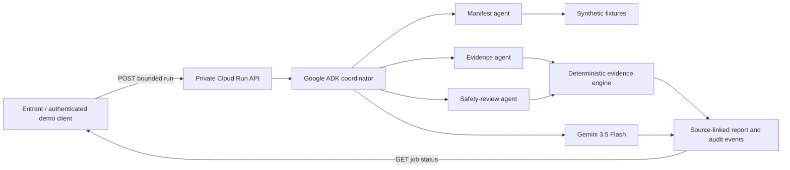

# Homeowner Quote Clarity Agent

An evidence-first Google ADK agent that turns three fictional home-repair quotations into a source-linked comparison, an ambiguity register, neutral contractor questions, and an auditable security log.

This project is being prepared for the Google All Things Agentic Hackathon, Taskmaster track. It is a demonstration, not professional advice, and it processes only the bundled synthetic fixtures.

## What it does

- extracts stated totals, tax basis, scope, allowances, exclusions, payment terms, timing, warranties, and validity;
- retains the source filename, line number, and SHA-256 excerpt hash for every fact;
- keeps unknown information unknown instead of inventing a value;
- quarantines an embedded prompt-injection attempt;
- uses a Google ADK coordinator with specialized manifest, evidence, and safety-review agents;
- exposes a bounded, request-scoped demo API suitable for an authenticated Cloud Run service; and
- never ranks contractors, assesses fairness, or sends messages or payments.

## Architecture



> **Verification boundary:** the deterministic engine, ADK definitions, and local API are verified. Gemini execution and Cloud Run deployment remain pending until approved event credits are visible.



The deterministic evidence engine is the source of truth. The planned Gemini role is to coordinate the bounded workflow and summarize validated results; it cannot change extracted totals, source anchors, or the no-ranking boundary. This model path is not claimed as working until a real run is captured and verified.

## Local deterministic demo

Requires Python 3.10 or newer. This path uses no network and no model.

```powershell
python .\run_demo.py
python -m unittest discover -s .\tests -v
```

Outputs are written to `demo-output/report.json` and `demo-output/comparison.md`. Repeated runs produce byte-identical JSON.

## Local ADK/API demo

The live agent path requires Google ADK 2.1.0 and Gemini 3.5 Flash. Keep credentials out of the repository.

```powershell
python -m venv .venv
.\.venv\Scripts\Activate.ps1
python -m pip install -r requirements.txt
$env:GOOGLE_GENAI_USE_ENTERPRISE = "TRUE"
$env:GOOGLE_CLOUD_PROJECT = "your-project-id"
$env:GOOGLE_CLOUD_LOCATION = "global"
$env:ENABLE_MODEL_RUN = "true"
python -m uvicorn app:app --host 127.0.0.1 --port 8080
```

In another terminal:

```powershell
Invoke-RestMethod -Method Post -Uri http://127.0.0.1:8080/v1/demo-runs
```

The response is returned only after the bounded ADK/model workflow finishes. The endpoint is disabled unless `ENABLE_MODEL_RUN=true`.

## Cloud Run deployment

Deployment is intentionally approval-gated. Proceed only after confirmed event credits are visible. Do not click **Activate**, upgrade billing, or deploy against an account that can create out-of-pocket charges.

```powershell
gcloud config set project YOUR_PROJECT_ID
gcloud services enable run.googleapis.com cloudbuild.googleapis.com artifactregistry.googleapis.com aiplatform.googleapis.com
gcloud run deploy quote-clarity-agent `
  --source . `
  --region us-central1 `
  --no-allow-unauthenticated `
  --min 0 `
  --max 1 `
  --concurrency 1 `
  --memory 512Mi `
  --cpu 1 `
  --timeout 300 `
  --set-env-vars GOOGLE_GENAI_USE_ENTERPRISE=TRUE,GOOGLE_CLOUD_LOCATION=global,QUOTE_CLARITY_MODEL=gemini-3.5-flash,ENABLE_MODEL_RUN=true
```

The service is private so anonymous users cannot trigger model calls. Invoke it with an authorized identity token. Before deployment, confirm the Cloud Billing overview shows approved event credits and no paid upgrade. Cloud Run, Cloud Build, Artifact Registry, and model inference can all consume credits; budget alerts are warnings rather than hard caps.

## API

- `GET /healthz` - health and configuration presence, never secret values.
- `POST /v1/demo-runs` - performs one bundled synthetic demonstration when explicitly enabled.

The authenticated endpoint, explicit enable switch, single-instance cap, and single-request concurrency are deliberate hackathon-demo controls, not a production architecture.

## Security and privacy

- No real customer, contractor, address, quote, or payment information is included.
- `.env`, API keys, service-account files, credentials, logs, and local environments are ignored.
- Source documents are treated as untrusted evidence, never instructions.
- The public endpoint accepts no arbitrary files or URLs.
- Errors expose only a stable error class, not credentials or raw provider responses.
- The application has no email, browser, payment, signing, scheduling, or purchasing tool.

See [SECURITY.md](SECURITY.md), [DISCLOSURES.md](DISCLOSURES.md), and [ORIGIN.md](ORIGIN.md).

## Current verification status

- Deterministic offline tests: implemented and runnable without credentials.
- ADK definitions and in-memory session initialization: verified locally without a model call.
- Gemini 3.5 Flash execution: not claimed until a real run succeeds and its bounded output is checked.
- Cloud Run deployment: not claimed until a no-charge deployment is verified.
- Devpost submission: draft only and requires the entrant's final approval.

## License

MIT. See [LICENSE](LICENSE).
